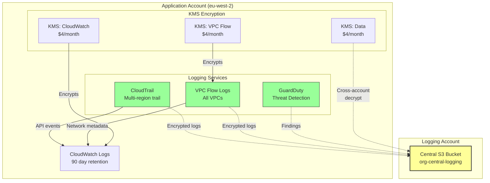
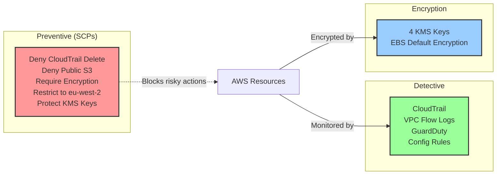

# AWS Secure Landing Zone - Technical Report

**Author:** Finlay Wright  
**Date:** November 2025  
**Submission:** AISI Product / Platform Security Challenge

---

## Overview

This repo provides a production-ready baseline for securing new AWS accounts. The implementation covers all four required deliverables through modular Terraform code that can be deployed independently or as a complete baseline.

**Deliverables:**
- A: Centralized logging (CloudTrail, VPC Flow Logs, GuardDuty)
- B: KMS encryption with EBS encryption by default
- C: Tagging enforcement via AWS Config
- D: Five preventive SCPs

The design prioritizes modularity, cross-account support, and practical deployment over theoretical completeness.

## Architecture

### Cross-Account Logging Flow



### Security Controls Overview



*Full architecture diagrams available in `/diagrams/architecture.md`*

---

## Key Design Decisions

### 1. Modular Architecture
Each security control is a standalone module. Teams can adopt incrementally or deploy the complete wrapper. Trade-off: slightly more complex setup vs flexibility.

### 2. Four Separate KMS Keys
Dedicated keys for EBS, CloudWatch Logs, VPC Flow Logs, and data encryption rather than one key. Limits blast radius, simpler policies, easier permission management. Cost: $16/month vs $4/month - worth it for separation.

### 3. Config for Tagging (Detective vs Preventive)
AWS Config rules flag missing tags rather than Tag Policies that block creation. Simpler to implement, provides compliance dashboard. For production, add Tag Policies for true enforcement.

---

## Assumptions

1. **AWS Organizations** is configured with management, security, and logging accounts
2. **Central logging S3 bucket** already exists in logging account with appropriate bucket policies
3. **Fresh account** being bootstrapped (applying to existing accounts will flag many non-compliant resources)
4. **Regional restrictions** to EU (London) for data residency (eu-west-2 primary region)
5. **Break-glass roles** exist for SCP exceptions (would need to customize ARNs in policy files)

---

## Trade-offs and Limitations

### What's Included
✅ All four core deliverables fully implemented
✅ Working Terraform code
✅ Cross-account logging and KMS access
✅ Cost-optimized defaults
✅ Clear documentation
✅ **Two stretch goals completed:**
  - Cross-account logging and KMS key access diagrams
  - Automated tag remediation Lambda  

### Known Limitations
- Tagging enforcement is detective only (Config rules flag violations but don't prevent)
- SCPs require manual application at Org level
- Some services (RDS, EFS) require encryption at creation time - no way to encrypt existing resources
- No automated alerting on GuardDuty findings (would integrate with SNS/Teams/Slack etc in production)
- Config requires pre-existing recorder and delivery channel (not included in this baseline)

---

## Rollout Strategy

**New Accounts (Automated):**
Platform team provisions accounts with baseline pre-applied via Terraform/Control Tower. Researchers receive credentials to already-secure accounts. No KMS configuration needed - encryption works automatically. Only requirement: tag resources. GuardDuty/CloudTrail invisible to users.

**Existing Accounts (4-week migration):**
- Week 1: Assess compliance gaps
- Week 2: Apply non-breaking changes (GuardDuty, KMS keys, Config rules)
- Weeks 3-4: Remediate with grace period (re-encrypt volumes, tag resources)
- Week 5: Enable SCPs once compliant

Success criteria: 90% compliance within 4 weeks, <5% exceptions ongoing.

**Production enhancements:** SIEM integration, CloudWatch alarms for GuardDuty findings, cross-region log replication, Tag Policies for preventive enforcement.

---

## Cost Summary

| Service | Per-account/month |
|---------|-------------------|
| CloudTrail | $5-10 |
| GuardDuty | $5-50 |
| VPC Flow Logs | $10-50 |
| KMS (4 keys) | $16 |
| Config (5 rules) | $8-10 |
| Auto-remediation Lambda | ~$0.20 |
| **Total** | **$44-146** |

At 100 accounts: $4,400-14,600/month

*Lambda cost is negligible (~$0.20/month) and covered by free tier for typical usage*

---

## Stretch Goals

The brief listed four optional stretch goals. I completed two and outlined implementation approaches for the others.

### ✅ Implemented: Cross-Account Logging and Key Access Diagrams

Created comprehensive Mermaid diagrams in `/diagrams/architecture.md` showing:
- Cross-account logging flow with CloudTrail, VPC Flow Logs, and GuardDuty sending encrypted logs to central S3
- KMS key architecture with four separate keys and cross-account decrypt permissions
- Security controls overview (preventive, detective, encryption)
- Deployment flow

These diagrams are embedded as code (Mermaid) for version control and render directly in GitHub.

### ✅ Implemented: Automated Tag Remediation

Built a Lambda function that automatically tags non-compliant resources when Config detects violations. Implementation in `/modules/tagging-enforcement/lambda/auto_tag_remediation.py`.

**How it works:**
1. EventBridge triggers Lambda on Config compliance change events
2. Lambda retrieves default tags from SSM Parameter Store (`/baseline/default-tags`)
3. Applies missing tags via Resource Groups Tagging API
4. For unsupported resource types, sends SNS notification for manual follow-up
5. Never overwrites existing tags - only fills in missing required tags

**Resources tagged:** EC2, RDS, S3, Lambda, DynamoDB, ECS, EKS, EFS

**Enable via Terraform:**
```hcl
enable_auto_remediation = true
```

**Additional cost:** ~$0.20/month (Lambda free tier covers typical usage)

### Not Implemented: Exception Tagging with Expiry

**Implementation approach if more time:**

Add support for temporary tag compliance exemptions that auto-expire:

1. **Tag format:** Resources can be tagged with `ExceptionExpiry: YYYY-MM-DD` and `ExceptionReason: "migration in progress"`
2. **Daily Lambda scan:** EventBridge + Lambda runs daily at 09:00 UTC
3. **Exception tracking:** Scans all resources with `ExceptionExpiry` tag using Resource Groups Tagging API
4. **Expiry handling:**
   - If date < today: Remove exception tag, resource becomes non-compliant again
   - If date > today + 90: Flag as excessive (max 90-day exceptions)
5. **Reporting:** Generate CSV report stored in S3 with all active exceptions and send weekly summary via SNS

**Benefits:** Allows controlled exceptions (e.g., during migrations) without permanent drift.

**Terraform additions:**
- `exception_scanner_lambda.py` (~200 lines)
- EventBridge scheduled rule (daily)
- S3 bucket for exception reports
- SNS topic for weekly summaries

### Not Implemented: Unit Tests for SCP Conditions

**Implementation approach if more time:**

Create Python test suite using AWS IAM Policy Simulator to validate SCP deny conditions:

1. **Test framework:** `pytest` + `boto3` + `moto` for AWS API mocking
2. **Test structure:** One test file per SCP policy (`test_deny_cloudtrail_delete.py`, etc.)
3. **Test cases:**
   ```python
   def test_deny_cloudtrail_delete():
       # Arrange: Create test trail ARN
       # Act: Simulate DeleteTrail action
       # Assert: Action is denied by SCP

   def test_allow_cloudtrail_describe():
       # Assert: Read-only actions still work
   ```
4. **Policy Simulator:** Use `simulate_custom_policy()` API to test each SCP condition
5. **CI/CD:** GitHub Actions workflow runs tests on PR, blocks merge if SCPs don't behave as expected

**Test coverage:**
- ✅ CloudTrail delete/stop actions denied
- ✅ Public S3 bucket creation denied
- ✅ Unencrypted EBS volume creation denied
- ✅ Actions in non-approved regions denied
- ✅ Log KMS key deletion denied
- ✅ Break-glass role exemptions work

**Benefits:** Prevents accidental SCP changes that weaken security posture.

**Example test file structure:**
```
tests/
  scps/
    test_deny_cloudtrail_delete.py
    test_deny_public_s3.py
    test_require_encryption.py
    test_restrict_regions.py
    test_protect_kms_keys.py
  conftest.py  # Shared fixtures
  requirements.txt  # pytest, boto3, moto
```

---

## Conclusion

This baseline provides practical account security with modular deployment. The implementation balances security controls with operational reality - focusing on easy adoption rather than comprehensive-but-unused solutions.

**Time spent:** ~7 hours

**Repository:** https://github.com/Finlay-Wright/aws-secure-landing-zone
