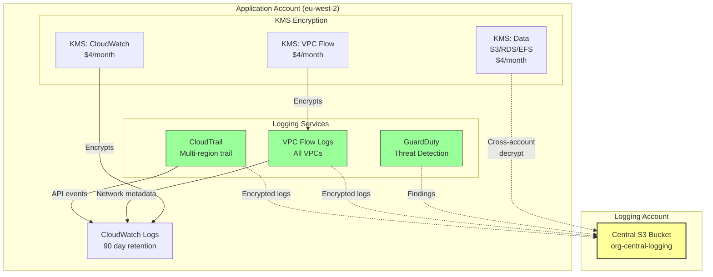
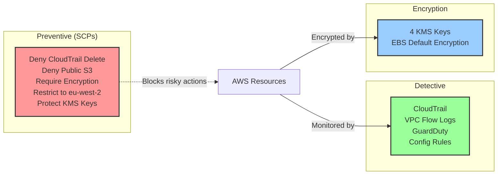

# AWS Secure Landing Zone - Technical Report

**Author:** Finlay Wright  
**Date:** 11th November 2025  
**Submission:** AISI Product / Platform Security Challenge

---

## Overview

This repo provides a starting baseline for securing new AWS accounts. The implementation covers all four required deliverables via Terraform code that can be deployed independently or as a complete baseline.

**Deliverables:**
- A: Centralized logging (CloudTrail, VPC Flow Logs, GuardDuty)
- B: KMS encryption with EBS encryption by default
- C: Tagging enforcement via AWS Config
- D: Five preventive SCPs

The design prioritises modularity, cross-account support, and practical deployment over theoretical completeness.

## Architecture

### Cross-Account Logging Flow



### Security Controls Overview



*Full architecture diagrams available in `/diagrams/architecture.md`*

---

## Key Design Decisions

### 1. Modular Architecture
Each security control is a standalone module. You could adopt incrementally or deploy the complete wrapper. Trade-off: slightly more complex setup vs flexibility.

### 2. Four Separate KMS Keys
I've created dedicated KMS keys for EBS, CloudWatch Logs, VPC Flow Logs, and data (S3, EBS etc) encryption rather than one key. This limits the blast radius in case of compromise, means simpler policies and easier permission management. Cost: $4/month vs $1/month - worth it for separation.

### 3. Config for Tagging (Detective vs Preventive)
AWS Config rules flag missing tags rather than Tag Policies that block creation. This is a bit simpler to implement and provides you with a compliance dashboard. For production, you would add Tag Policies for proper enforcement.

---

## Alignment with AWS Well-Architected Framework

This baseline implements key recommendations from the Security Pillar of the AWS Well-Architected Framework:

- **Data Protection (SEC08/09):** Customer-managed KMS keys with automatic rotation, encryption at rest by default
- **Detection (SEC03):** Multi-layered logging (CloudTrail, VPC Flow Logs) and threat detection (GuardDuty)
- **Infrastructure Protection (SEC05):** Service Control Policies as preventive guardrails
- **Incident Response (SEC10):** Centralized log aggregation enables investigation and forensics

The modular design also supports the Operational Excellence pillar by allowing incremental adoption and infrastructure as code deployment.

---

## Assumptions

I've made a couple of key assumptions that impact how these modules all glue together:

1. **AWS Organizations** is configured with management, security, and logging accounts
2. **A Central logging S3 bucket** already exists in logging account with appropriate bucket policies
3. **Fresh account** being is bootstrapped (applying this to existing accounts would likely flag a load of non-compliant resources)
4. **Regional restrictions** to EU-West-2 (London) for data residency
5. **Break-glass roles** exist for SCP exceptions (would need to customize ARNs in policy files)

---

## Trade-offs and Limitations

### What's Included
✅ All four core deliverables fully implemented
✅ Working Terraform code
✅ Cross-account logging and KMS access
✅ Cost-optimized defaults
✅ Clear documentation
✅ **Two stretch goals completed:**
  - Cross-account logging and KMS key access diagrams
  - Automated tag remediation Lambda  

### Known Limitations
- Tagging enforcement is detective only (Config rules flag violations but don't prevent)
- SCPs require manual application at Org level
- Some services (RDS, EFS) require encryption at creation time - no way to encrypt existing resources
- No automated alerting on GuardDuty findings (would integrate with SNS/Teams/Slack etc in production)
- Config requires pre-existing recorder and delivery channel (not included in this baseline)

---

## Rollout Strategy

**New Accounts (Automated):**
A Platform/Security team could provision new accounts with this baseline pre-applied via Terraform/Control Tower. Researchers receive credentials to already-secure accounts. Only requirement on them would be to tag resources.

**Existing Accounts (4-phase migration):**
- **Phase 1:** Assess compliance gaps (terraform plan, identify breaking changes)
- **Phase 2:** Apply non-breaking changes (GuardDuty, KMS keys, Config rules)
- **Phase 3:** Remediate with grace period (re-encrypt volumes, tag resources)
- **Phase 4:** Enable SCPs once compliant

**Production enhancements:** SIEM integration, CloudWatch alarms for GuardDuty findings, cross-region log replication, Tag Policies for preventive enforcement.

---

## Cost Summary

| Service | Per-account/month |
|---------|-------------------|
| CloudTrail | $5-10 |
| GuardDuty | $5-50 |
| VPC Flow Logs | $10-50 |
| KMS (4 keys) | $4 |
| Config (5 rules) | $8-10 |
| Auto-remediation Lambda | ~$0.20 |
| **Total** | **$32-124** |

At 100 accounts: $3,200-12,400/month

*Lambda cost is negligible (~$0.20/month) and covered by free tier for typical usage*

---

## Stretch Goals

The brief listed four optional stretch goals. I completed two of them and have outlined implementation approaches for the others.

### ✅ Implemented: Cross-Account Logging and Key Access Diagrams

Created Mermaid diagrams in `/diagrams/architecture.md` showing:
- Cross-account logging flow with CloudTrail, VPC Flow Logs, and GuardDuty sending encrypted logs to central S3
- KMS key architecture with four separate keys and cross-account decrypt permissions
- Security controls overview (preventive, detective, encryption)
- Deployment flow

These diagrams are embedded as code (Mermaid) for version control and should hopefully render nicely in GitHub!

### ✅ Implemented: Automated Tag Remediation

Included a Lambda function that automatically tags non-compliant resources when Config detects violations. Implementation in `/modules/tagging-enforcement/lambda/auto_tag_remediation.py`.

**How it works:**
1. EventBridge triggers Lambda on Config compliance change events
2. Lambda retrieves default tags from SSM Parameter Store (`/baseline/default-tags`)
3. Applies missing tags via Resource Groups Tagging API
4. For unsupported resource types, sends SNS notification for manual follow-up
5. Never overwrites existing tags - only fills in missing required tags

**Resources tagged:** EC2, RDS, S3, Lambda, DynamoDB, ECS, EKS, EFS

### Not Implemented: Exception Tagging with Expiry

**Implementation approach if more time:**

Add support for temporary tag compliance exemptions that auto-expire:

1. **Tag format:** Resources could be tagged with `ExceptionExpiry: YYYY-MM-DD` and `ExceptionReason: "migration in progress"`
2. **Daily Lambda scan:** EventBridge + Lambda configured to run daily.
3. **Exception tracking:** Scans all resources with `ExceptionExpiry` tag using Resource Groups Tagging API
4. **Expiry handling:**
   - If date < today: Remove exception tag, resource becomes non-compliant again
   - If date > today + 90: Flag as excessive (max 90-day exceptions)
5. **Reporting:** Plenty of options but something like generating a report stored in S3 with all active exceptions and sending weekly summary via SNS would be a good start.

**Benefits:** Allows controlled exceptions (e.g. during migrations) without permanent drift.

### Not Implemented: Unit Tests for SCP Conditions

**Implementation approach if more time:**

Create a based Python test suite using AWS IAM Policy Simulator to validate SCP deny conditions:

1. **Test structure:** One test file per SCP policy (`test_deny_cloudtrail_delete.py`, etc.)
2. **Test cases:**
   ```python
   def test_deny_cloudtrail_delete():
       # Arrange: Create test trail ARN
       # Act: Simulate DeleteTrail action
       # Assert: Action is denied by SCP

   def test_allow_cloudtrail_describe():
       # Assert: Read-only actions still work
   ```
3. **Policy Simulator:** Use `simulate_custom_policy()` API to test each SCP condition
4. **CI/CD:** You could create a GitHub Actions workflow runs tests on PR, blocks merge if SCPs don't behave as expected

**Benefits:** Prevents accidental SCP changes that weaken security posture.

---

## Deployment Evidence

Screenshots of the working deployment are available in `/screenshots/`. These demonstrate all core controls successfully deployed and operational in a test AWS account (eu-west-2).

---

## Conclusion

This baseline provides practical account security with modular deployment. The implementation balances security controls with operational reality - focusing on easy adoption rather than comprehensive-but-unused solutions. I'm looking forward to hearing your feedback!
