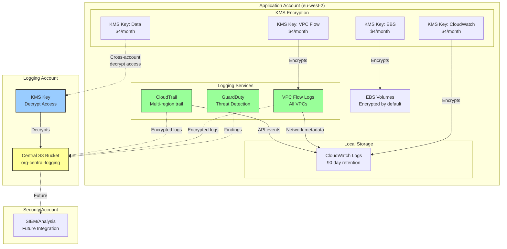
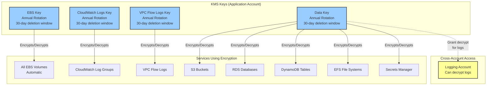
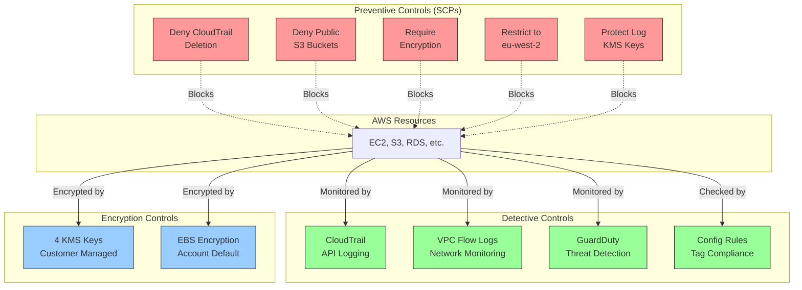
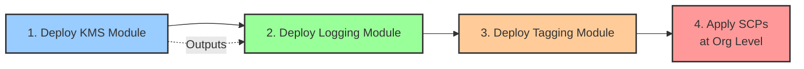

# Architecture Diagrams

## Cross-Account Logging Flow

```mermaid
graph TB
    subgraph "Application Account (eu-west-2)"
        subgraph "Logging Services"
            CT[CloudTrail<br/>Multi-region trail]
            VPC[VPC Flow Logs<br/>All VPCs]
            GD[GuardDuty<br/>Threat Detection]
        end
        
        subgraph "KMS Encryption"
            KMS_EBS[KMS Key: EBS<br/>$4/month]
            KMS_CW[KMS Key: CloudWatch<br/>$4/month]
            KMS_VPC[KMS Key: VPC Flow<br/>$4/month]
            KMS_DATA[KMS Key: Data<br/>$4/month]
        end
        
        subgraph "Local Storage"
            CW[CloudWatch Logs<br/>90 day retention]
        end
        
        EBS[EBS Volumes<br/>Encrypted by default]
    end
    
    subgraph "Logging Account"
        S3[Central S3 Bucket<br/>org-central-logging]
        S3_KMS[KMS Key<br/>Decrypt Access]
    end
    
    subgraph "Security Account"
        SIEM[SIEM/Analysis<br/>Future Integration]
    end
    
    CT -->|API events| CW
    VPC -->|Network metadata| CW
    
    KMS_CW -->|Encrypts| CW
    KMS_VPC -->|Encrypts| VPC
    KMS_EBS -->|Encrypts| EBS
    
    CT -.->|Encrypted logs| S3
    VPC -.->|Encrypted logs| S3
    GD -.->|Findings| S3
    
    KMS_DATA -.->|Cross-account<br/>decrypt access| S3_KMS
    S3_KMS -->|Decrypts| S3
    
    S3 -.->|Future| SIEM
    
    style S3 fill:#ff9,stroke:#333,stroke-width:2px
    style S3_KMS fill:#9cf,stroke:#333,stroke-width:2px
    style CT fill:#9f9,stroke:#333
    style VPC fill:#9f9,stroke:#333
    style GD fill:#9f9,stroke:#333
```

## KMS Key Architecture

```mermaid
graph TB
    subgraph "KMS Keys (Application Account)"
        KMS_EBS[EBS Key<br/>Annual Rotation<br/>30-day deletion window]
        KMS_CW[CloudWatch Logs Key<br/>Annual Rotation<br/>30-day deletion window]
        KMS_VPC[VPC Flow Logs Key<br/>Annual Rotation<br/>30-day deletion window]
        KMS_DATA[Data Key<br/>Annual Rotation<br/>30-day deletion window]
    end
    
    subgraph "Services Using Encryption"
        EBS[All EBS Volumes<br/>Automatic]
        CW[CloudWatch Log Groups]
        VPC[VPC Flow Logs]
        S3[S3 Buckets]
        RDS[RDS Databases]
        DDB[DynamoDB Tables]
        EFS[EFS File Systems]
        SEC[Secrets Manager]
    end
    
    subgraph "Cross-Account Access"
        LOG_ACCT[Logging Account<br/>Can decrypt logs]
    end
    
    KMS_EBS -->|Encrypts/Decrypts| EBS
    KMS_CW -->|Encrypts/Decrypts| CW
    KMS_VPC -->|Encrypts/Decrypts| VPC
    
    KMS_DATA -->|Encrypts/Decrypts| S3
    KMS_DATA -->|Encrypts/Decrypts| RDS
    KMS_DATA -->|Encrypts/Decrypts| DDB
    KMS_DATA -->|Encrypts/Decrypts| EFS
    KMS_DATA -->|Encrypts/Decrypts| SEC
    
    KMS_DATA -.->|Grant decrypt<br/>for logs| LOG_ACCT
    
    style KMS_EBS fill:#9cf,stroke:#333,stroke-width:2px
    style KMS_CW fill:#9cf,stroke:#333,stroke-width:2px
    style KMS_VPC fill:#9cf,stroke:#333,stroke-width:2px
    style KMS_DATA fill:#9cf,stroke:#333,stroke-width:2px
    style LOG_ACCT fill:#ff9,stroke:#333,stroke-width:2px
```

## Security Controls Overview

```mermaid
graph TB
    subgraph "Preventive Controls (SCPs)"
        SCP1[Deny CloudTrail<br/>Deletion]
        SCP2[Deny Public<br/>S3 Buckets]
        SCP3[Require<br/>Encryption]
        SCP4[Restrict to<br/>eu-west-2]
        SCP5[Protect Log<br/>KMS Keys]
    end
    
    subgraph "Detective Controls"
        CT[CloudTrail<br/>API Logging]
        VPC[VPC Flow Logs<br/>Network Monitoring]
        GD[GuardDuty<br/>Threat Detection]
        CFG[Config Rules<br/>Tag Compliance]
    end
    
    subgraph "Encryption Controls"
        KMS[4 KMS Keys<br/>Customer Managed]
        EBS_ENC[EBS Encryption<br/>Account Default]
    end
    
    subgraph "AWS Resources"
        RES[EC2, S3, RDS, etc.]
    end
    
    SCP1 -.->|Blocks| RES
    SCP2 -.->|Blocks| RES
    SCP3 -.->|Blocks| RES
    SCP4 -.->|Blocks| RES
    SCP5 -.->|Blocks| RES
    
    RES -->|Monitored by| CT
    RES -->|Monitored by| VPC
    RES -->|Monitored by| GD
    RES -->|Checked by| CFG
    
    RES -->|Encrypted by| KMS
    RES -->|Encrypted by| EBS_ENC
    
    style SCP1 fill:#f99,stroke:#333
    style SCP2 fill:#f99,stroke:#333
    style SCP3 fill:#f99,stroke:#333
    style SCP4 fill:#f99,stroke:#333
    style SCP5 fill:#f99,stroke:#333
    
    style CT fill:#9f9,stroke:#333
    style VPC fill:#9f9,stroke:#333
    style GD fill:#9f9,stroke:#333
    style CFG fill:#9f9,stroke:#333
    
    style KMS fill:#9cf,stroke:#333
    style EBS_ENC fill:#9cf,stroke:#333
```

## Deployment Flow

```mermaid
graph LR
    A[1. Deploy KMS Module] --> B[2. Deploy Logging Module]
    B --> C[3. Deploy Tagging Module]
    C --> D[4. Apply SCPs<br/>at Org Level]
    
    A -.->|Outputs| B
    
    style A fill:#9cf,stroke:#333,stroke-width:2px
    style B fill:#9f9,stroke:#333,stroke-width:2px
    style C fill:#fc9,stroke:#333,stroke-width:2px
    style D fill:#f99,stroke:#333,stroke-width:2px
```
